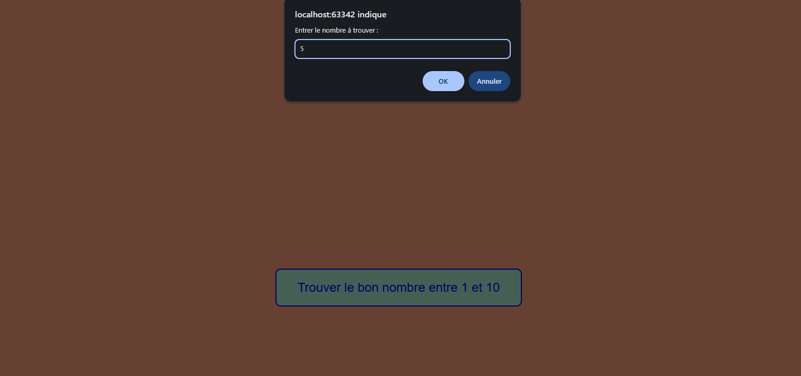
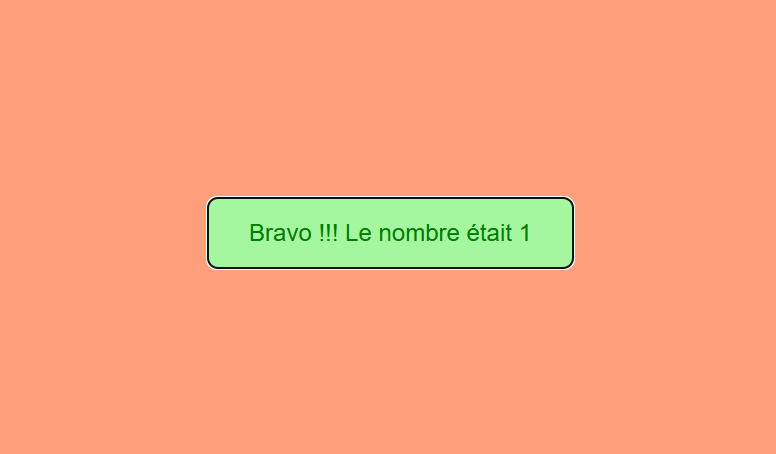

# 🎮 Jeu de Devinette de Nombre

Un jeu simple et interactif où vous devez deviner un nombre aléatoire entre 1 et 10.

## 📝 Description

Ce projet est une application web simple qui génère un nombre aléatoire entre 1 et 10. Le joueur doit deviner ce nombre en entrant sa proposition. L'application donne des indices pour savoir si le nombre proposé est trop grand ou trop petit.

## ✨ Fonctionnalités

- 🎲 Génération d'un nombre aléatoire entre 1 et 10
- 🖥️ Interface utilisateur simple avec un bouton interactif
- 👁️ Retour visuel sur la proposition du joueur
- ✅ Validation des entrées utilisateur
- 💬 Messages d'encouragement et de feedback

## 🎯 Comment jouer

1. Cliquez sur le bouton "Trouver le bon nombre entre 1 et 10"
2. Entrez votre proposition dans la boîte de dialogue
3. Recevez un feedback sur votre proposition
4. Continuez jusqu'à ce que vous trouviez le bon nombre

## 🛠️ Technologies utilisées

- 🌐 HTML5
- 🎨 CSS3
- ⚡ JavaScript (Vanilla)

## 📥 Installation

1. Clonez ce dépôt
2. Ouvrez le fichier `index.html` dans votre navigateur web

## 📁 Structure du projet

- 📄 `index.html` - Structure de la page web
- 🎨 `style.css` - Styles et mise en forme
- ⚙️ `script.js` - Logique du jeu

## 📜 Licence

Ce projet est sous licence MIT.

## 📸 Captures d'écran

### Interface du jeu

### Exemple de partie

### Message de victoire

### Message de victoire

